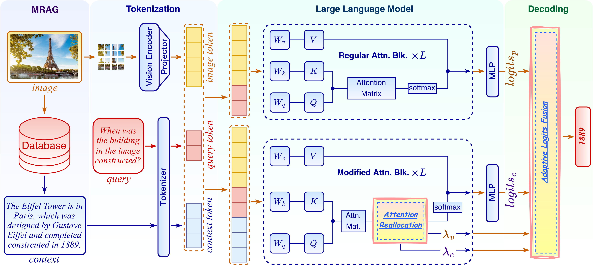

# ALFAR: Adaptive Logits Fusion and Attention Reallocation

[](https://arxiv.org/abs/2406.12718)

Official implementation of the paper **"Boosting Knowledge Utilization in Multimodal Large Language Models via Adaptive Logits Fusion and Attention Reallocation"**.

## 👥 Authors
Wenbin An, Jiahao Nie, Feng Tian, Haonan Lin, Mingxiang Cai, Yaqiang Wu, Qianying Wang, Xiaoqin Zhang, Shijian Lu

## 📝 Abstract
Multimodal Large Language Models (MLLMs) have demonstrated remarkable capabilities, yet they often underperform in knowledge-intensive tasks due to limitations in their parametric knowledge. Multimodal Retrieval Augmented Generation (MRAG) addresses this issue by retrieving relevant contextual knowledge from external databases. However, current MLLMs frequently fail to effectively utilize this retrieved knowledge during response generation.

Through analysis of representative MLLMs, we identify two primary challenges: **attention bias** toward different tokens and **knowledge conflicts** between parametric and contextual knowledge. To address these issues, we propose **ALFAR** (Adaptive Logits Fusion and Attention Reallocation), a training-free, plug-and-play approach that enhances MLLM responses by optimizing the utilization of retrieved knowledge.

ALFAR operates through two key mechanisms:
- **Attention Reallocation**: Adaptively shifts attention from visual tokens to relevant context tokens based on query-context relevance
- **Logits Fusion**: Decouples and weights parametric and contextual knowledge at the output level to mitigate conflicts

Extensive experiments across multiple MLLMs and benchmarks demonstrate that ALFAR consistently outperforms state-of-the-art methods by significant margins, without requiring additional training or external tools.

## 🏗️ Framework Overview
<div align="center">

</div>

## 📚 Contents
- [Data](#data)
- [Model](#model)
- [Requirements](#requirements)
- [Running](#running)
- [Acknowledgements](#acknowledgements)
- [Citation](#citation)

## 📊 Data
We evaluate ALFAR on five public datasets:
- [**Infoseek**](https://github.com/open-vision-language/infoseek)
- [**ViQuAE**](https://github.com/PaulLerner/ViQuAE)
- [**E-VQA**](https://github.com/google-research/google-research/tree/master/encyclopedic_vqa)
- [**OK-VQA**](https://okvqa.allenai.org/index.html)
- [**AOK-VQA**](https://github.com/allenai/aokvqa)

Question data for these datasets is provided in `data/eval_data`. Please download the corresponding images from the respective dataset links. Evaluation scripts are available in `./evaluation`.

You will also need to download the processed knowledge base from the following link: [Knowledge base](https://drive.google.com/file/d/18uFkE9SbPnUT9DLBd8DCfed6ah2sDbrJ/view?usp=sharing). After downloading, please save the file to the designated `data/wiki directory` to ensure the application functions correctly.


## 🤖 Model
ALFAR has been validated on four popular LVLMs:
- [**LLaVA**](https://github.com/haotian-liu/LLaVA)
- [**InstructBLIP**](https://github.com/salesforce/LAVIS)
- [**Shikra**](https://github.com/shikras/shikra)
- [**MiniGPT-4 (Llama 2 Chat 7B)**](https://github.com/Vision-CAIR/MiniGPT-4)

## ⚙️ Requirements
- Python 3.9
- Core dependencies listed in `requirements.txt`, please note that TensorFlow is additionally required to run the E-VQA evaluation.

## 🚀 Running
To run experiments, navigate to the `experiments/eval` directory and execute:

For multi-choice evaluation (example with LLaVA on Infoseek):
```bash
python alfar_mc_llava.py --dataset infoseek --image-folder /path/to/infoseek/images
```


## 🙏 Acknowledgements
Our implementation refers to the repositories of [VCD](https://github.com/DAMO-NLP-SG/VCD) and [PAI](https://github.com/LALBJ/PAI). We thank the authors for their valuable work.

## 📄 Citation
If you find our work useful, please consider citing:
```bibtex
@article{an2024alfar,
  title={Boosting Knowledge Utilization in Multimodal Large Language Models via Adaptive Logits Fusion and Attention Reallocation},
  author={An, Wenbin and Nie, Jiahao and Tian, Feng and Lin, Haonan and Cai, Mingxiang and Wu, Yaqiang and Wang, Qianying and Zhang, Xiaoqin and Lu, Shijian},
  journal={arXiv preprint arXiv:2406.12718},
  year={2024}
}
```

---
<div align="center">
<sub>✨ If you like our work, give it a star! ⭐</sub>
</div>